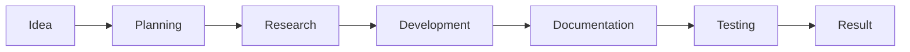
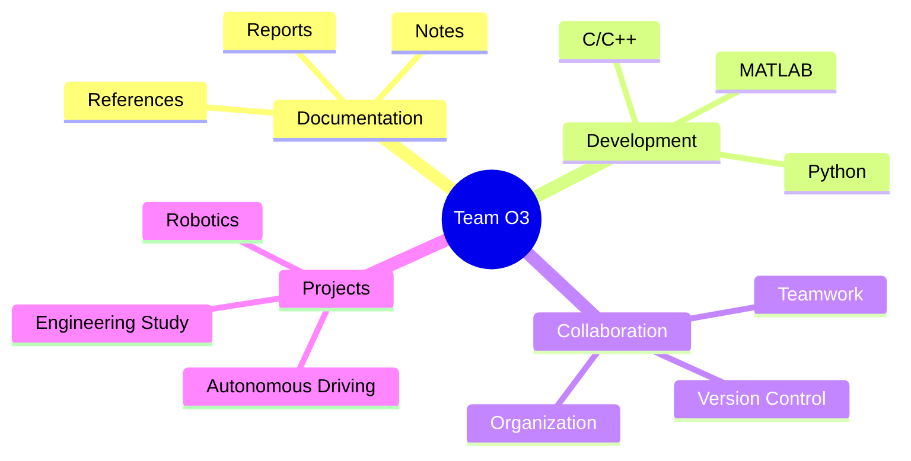

<div align="center">


# intellion_O3

### Hanyang University Electrical Engineering  
### Intellion Club Project Repository


<br>


<br><br>


</div>

---

## About Project

<div align="center">

> 한양대학교 전기공학과 인텔리온 동아리 **Team O3**의  
> 프로젝트 자료, 코드, 문서, 기록을 체계적으로 정리하고 관리하는 저장소입니다.

</div>

<br>

<div align="center">
  
</div>

---

## Team Members

<div align="center">

<table>
  <tr>
    <td align="center" width="180">
      <br>
      <b>서유겸</b><br>
      Team Member
    </td>
    <td align="center" width="180">
      <br>
      <b>이아윤</b><br>
      Team Member
    </td>
    <td align="center" width="180">
      <br>
      <b>신채은</b><br>
      Team Member
    </td>
    <td align="center" width="180">
      <br>
      <b>정상현</b><br>
      Team Member
    </td>
  </tr>
</table>

</div>

---

## Project Vision

<div align="center">

| Keyword | Description |
|:--:|:--|
| **Documentation** | 프로젝트 진행 과정과 결과를 체계적으로 기록 |
| **Development** | 코드 구현 및 시스템 개발 |
| **Organization** | 자료, 문서, 코드를 일관성 있게 관리 |
| **Collaboration** | 팀원 간 효율적인 협업 환경 구축 |

</div>

---

## Tech Stack

<div align="center">


</div>

<br>

<div align="center">

| Category | Tools |
|:--:|:--|
| Version Control | GitHub, Git |
| Programming | Python, C, C++ |
| Engineering | MATLAB |
| Environment | VS Code |

</div>

---

## Key Objectives

<div align="center">

<table>
  <tr>
    <td align="center" width="260">
      <br>
      <b>Project Archive</b><br>
      프로젝트 자료 정리
    </td>
    <td align="center" width="260">
      <br>
      <b>Code Management</b><br>
      코드 및 버전 관리
    </td>
    <td align="center" width="260">
      <br>
      <b>Team Collaboration</b><br>
      협업 기록 및 역할 분담
    </td>
  </tr>
  <tr>
    <td align="center" width="260">
      <br>
      <b>Result Tracking</b><br>
      결과물 및 진행상황 관리
    </td>
    <td align="center" width="260">
      <br>
      <b>Robotics Focus</b><br>
      자율주행 및 로보틱스 관련 활동
    </td>
    <td align="center" width="260">
      <br>
      <b>Continuous Update</b><br>
      지속적인 개선과 업데이트
    </td>
  </tr>
</table>

</div>

---

## Repository Structure

```bash
intellion_O3/
├── docs/            # documents, reports, meeting notes
├── src/             # main source code
├── matlab/          # MATLAB scripts and simulation files
├── python/          # Python scripts
├── c_cpp/           # C/C++ source files
├── assets/          # images and additional resources
└── README.md
```

---

## Workflow



---

## Progress Overview

<div align="center">

| Category | Progress |
|:--|:--|
| Documentation |  |
| Development |  |
| Collaboration |  |
| Repository Setup |  |

</div>

---

## Project Highlights

<div align="center">



</div>

---

## Team Principles

<div align="center">

| Principle | Meaning |
|:--:|:--|
| **Clarity** | 자료와 코드를 누구나 보기 쉽게 정리 |
| **Consistency** | 파일 구조와 문서 형식을 통일 |
| **Responsibility** | 맡은 역할을 끝까지 수행 |
| **Growth** | 프로젝트와 함께 팀도 함께 성장 |

</div>

---

## Notes

- 프로젝트 관련 자료와 코드는 지속적으로 업데이트될 예정입니다.
- 저장소 구조는 프로젝트 진행 상황에 따라 변경될 수 있습니다.
- 문서, 코드, 결과물은 팀 협업 기준에 맞춰 관리합니다.

---

## Team Message

<div align="center">

## ⚡ Organized for Collaboration  
## 🤖 Built for Robotics  
## 🚀 Growing as Team O3

</div>

<br>

<div align="center">
  
</div>
